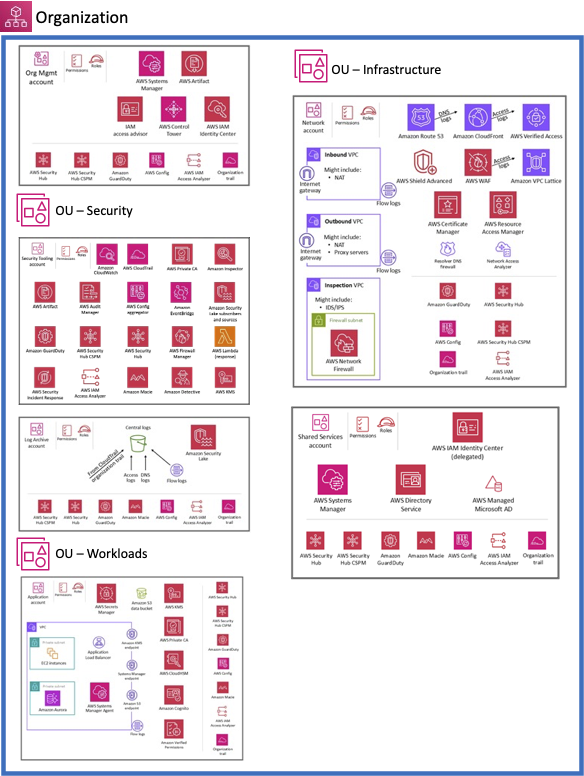

# AWS Control Tower Landing Zone

Policy-governed, secure-by-design, multi-account AWS environment managed as code with the AWS Landing Zone Accelerator (LZA).

## Table of Contents
- [Overview](#overview)

*** 

## Overview 

This repository is the declarative source of truth for the Ilysium AWS Landing Zone - a multi-account enterprise cloud environment built on the AWS Security Reference Architecture. It leverages the [AWS Landing Zone Accelerator](https://docs.aws.amazon.com/solutions/landing-zone-accelerator-on-aws/), a solution that deploys a foundational set of capabilities designed to align with AWS best practices and multiple global compliance frameworks.

> [!NOTE]
> This repo contains no application logic. It is pure YAML configuration that LZA's engine (maintained separately by AWS at [awslabs/landing-zone-accelerator-on-aws](https://github.com/awslabs/landing-zone-accelerator-on-aws)) interprets to provision and manage the environment's account structure, policy guardrails, network baseline, and security services.

WIP